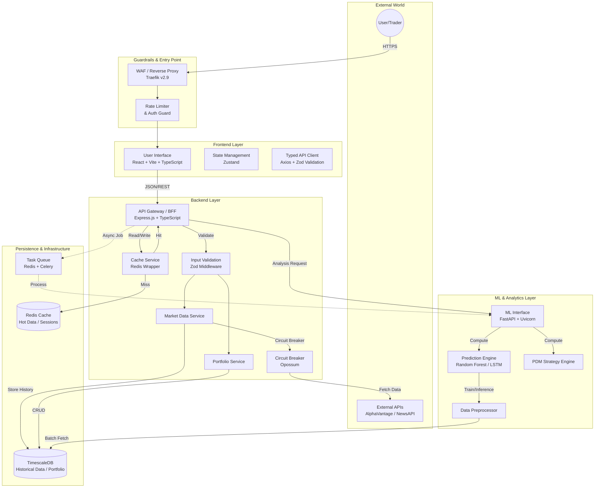
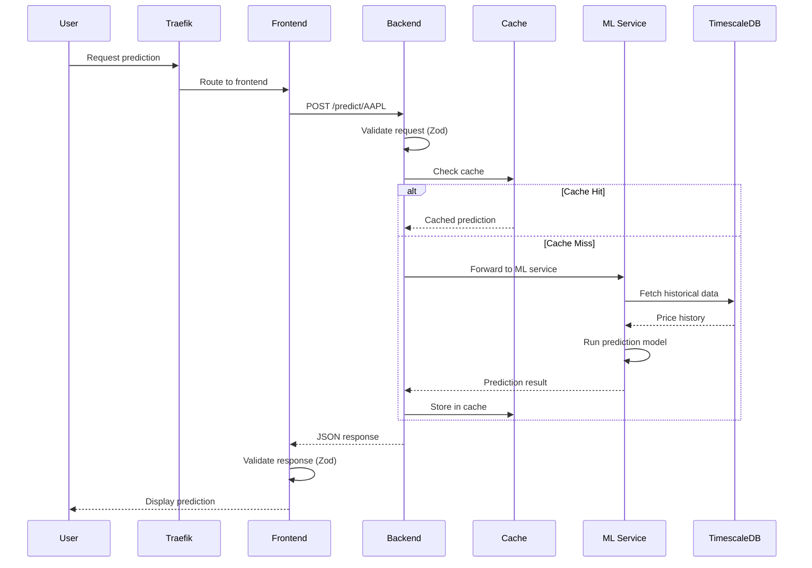

# Roneira AI HIFI - Architecture Documentation

> **C4 Container Architecture** - A comprehensive guide to the system design

## Overview

Roneira AI HIFI is a production-ready AI-powered financial intelligence platform built using the **C4 Container Architecture** pattern. This document describes the system's architecture, component interactions, and guardrails.

---

## C4 Container Diagram



---

## Component Details

### 1. Entry Point Layer (Guardrails)

| Component | Technology | Purpose |
|-----------|------------|---------|
| Reverse Proxy | Traefik v2.9 | SSL termination, routing, load balancing |
| Rate Limiter | Express Rate Limit | API abuse prevention |
| CORS | Express CORS | Cross-origin security |

### 2. Frontend Layer

| Component | Technology | Purpose |
|-----------|------------|---------|
| UI | React 18 + TypeScript | User interface |
| Build Tool | Vite 7 | Fast development & builds |
| State | Zustand | Lightweight state management |
| Validation | Zod | Runtime API response validation |
| API Client | Axios + Typed Client | Type-safe HTTP requests |
| Error Handling | ErrorBoundary | Graceful UI failure recovery |

**Key Files:**
- `frontend/src/services/apiClient.ts` - Typed API client with Zod validation
- `frontend/src/schemas/apiSchemas.ts` - Response validation schemas
- `frontend/src/components/ErrorBoundary.tsx` - Error boundary component

### 3. Backend Layer

| Component | Technology | Purpose |
|-----------|------------|---------|
| API Gateway | Express.js + TypeScript | Request routing, aggregation |
| Validation | Zod Middleware | Request body validation |
| Cache Service | ioredis | Redis wrapper with connection pooling |
| Circuit Breaker | Opossum | External API failure handling |
| Database | pg (node-postgres) | TimescaleDB connectivity |

**Key Files:**
- `backend/src/config/environment.ts` - Env var validation (fail-fast)
- `backend/src/middleware/zodValidation.ts` - Request validation
- `backend/src/services/circuitBreaker.ts` - Circuit breaker patterns
- `backend/src/services/redisWrapper.ts` - Redis cache service
- `backend/src/services/databaseService.ts` - TimescaleDB operations

### 4. ML Service Layer

| Component | Technology | Purpose |
|-----------|------------|---------|
| API Framework | FastAPI + Uvicorn | Async HTTP + auto docs |
| ML Models | Random Forest, LSTM | Stock price prediction |
| PDM Engine | Custom Python | Trading signal generation |
| Validation | Pydantic | Request/response validation |
| Task Queue | Celery + Redis | Async training jobs |

**Key Files:**
- `ml-service/main.py` - FastAPI application
- `ml-service/src/models/request_models.py` - Pydantic schemas
- `ml-service/pdm_strategy_engine.py` - PDM strategy logic

### 5. Persistence Layer

| Component | Technology | Purpose |
|-----------|------------|---------|
| Time-Series DB | TimescaleDB (PG 14) | Historical price data, portfolio |
| Cache | Redis 7 | API response caching, sessions |
| Task Queue | Redis 7 | Celery broker for async jobs |
| Model Storage | Docker Volume | Trained ML model persistence |

---

## Guardrails Summary

| Guardrail | Location | Implementation |
|-----------|----------|----------------|
| **Env Validation** | Backend startup | Zod schema, fail-fast |
| **Request Validation** | All endpoints | Zod middleware |
| **Response Validation** | Frontend | Typed API client + Zod |
| **Circuit Breakers** | External APIs | Opossum (50% threshold, 30s reset) |
| **Rate Limiting** | API Gateway | 100 req/15min per client |
| **Error Boundaries** | React UI | Graceful error recovery |
| **Pre-commit Hooks** | Git | TypeScript, ESLint, flake8 |

---

## Data Flow

### Stock Prediction Request



---

## Deployment

### Docker Compose

```bash
# Development
docker-compose up -d --build

# View logs
docker-compose logs -f

# Stop all services
docker-compose down
```

### Services & Ports

| Service | Internal Port | External Port | URL |
|---------|---------------|---------------|-----|
| Traefik | 80/443 | 80/443 | http://localhost |
| Traefik Dashboard | 8080 | 8080 | http://localhost:8080 |
| Backend | 3001 | (via Traefik) | /api/* |
| ML Service | 8000 | (via Traefik) | /api/ml/* |
| TimescaleDB | 5432 | 5432 | localhost:5432 |
| Redis Cache | 6379 | 6379 | localhost:6379 |
| Task Queue | 6379 | 6380 | localhost:6380 |

---

## Environment Variables

### Required

| Variable | Service | Description |
|----------|---------|-------------|
| `POSTGRES_PASSWORD` | All | Database password |
| `ALPHA_VANTAGE_API_KEY` | Backend, ML | Stock data API key |

### Optional

| Variable | Default | Description |
|----------|---------|-------------|
| `NODE_ENV` | development | Environment mode |
| `HUGGING_FACE_API_KEY` | - | Sentiment analysis |
| `RATE_LIMIT_MAX_REQUESTS` | 100 | Max requests per window |

---

## Testing

### Unit Tests
```bash
# Backend
cd backend && npm test

# Frontend
cd frontend && npm test

# ML Service
cd ml-service && pytest
```

### Integration Tests
```bash
# Start services
docker-compose up -d

# Run integration tests
cd backend && npm run test:integration
```

---

## Related Documentation

- [README.md](./README.md) - Project overview
- [CONTRIBUTING.md](./CONTRIBUTING.md) - Contribution guidelines
- [DEPLOYMENT.md](./DEPLOYMENT.md) - Deployment instructions
