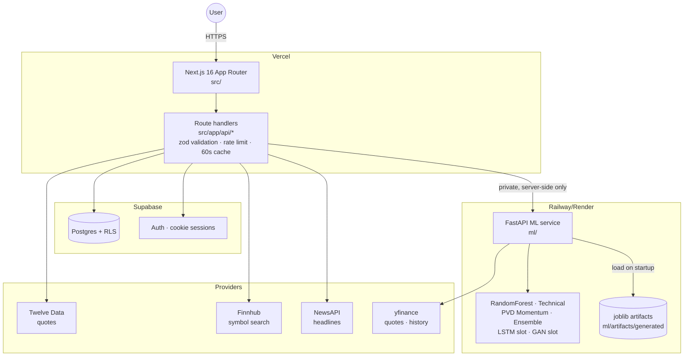

# Architecture

Roneira AI HIFI is an AI-assisted financial intelligence platform: live market data, ML
price projections, portfolio and watchlist tracking, and an append-only audit trail.

Two trees are built, tested, and deployed. Everything else in the repo root is legacy
reference material and is **not** wired into CI — see [Canonical surfaces](#canonical-surfaces).

## System shape


```mermaid
graph TD
    User((User)) -->|HTTPS| Next

    subgraph Vercel
        Next[Next.js 16 App Router<br/>src/]
        Routes[Route handlers<br/>src/app/api/*<br/>zod validation · rate limit · 60s cache]
        Next --> Routes
    end

    subgraph Supabase
        PG[(Postgres + RLS)]
        Auth[Auth · cookie sessions]
    end

    subgraph Providers
        TD[Twelve Data<br/>quotes]
        FH[Finnhub<br/>symbol search]
        NA[NewsAPI<br/>headlines]
        YF[yfinance<br/>quotes · history]
    end

    subgraph Railway/Render
        ML[FastAPI ML service<br/>ml/]
        Models[RandomForest · Technical<br/>PVD Momentum · Ensemble<br/>LSTM slot · GAN slot]
        Artifacts[(joblib artifacts<br/>ml/artifacts/generated)]
        ML --> Models
        ML -->|load on startup| Artifacts
    end

    Routes --> Auth
    Routes --> PG
    Routes --> TD
    Routes --> FH
    Routes --> NA
    Routes -->|private, server-side only| ML
    ML --> YF
```

The ML service is never exposed to the browser. All ML traffic goes through
`src/app/api/predict`, which validates the payload before forwarding.

## Canonical surfaces

| Canonical (built, tested, deployed) | Legacy (unmaintained, not in CI) |
|---|---|
| `src/` — Next.js 16 app → Vercel | `frontend/` — old Vite + React app |
| `ml/` — FastAPI ML service → Railway/Render | `backend/`, `ml-service/` — old Express / FastAPI services |

`realtime/` (Socket.IO tick service) is **also reference-only**, per `task.md`: its CORS
default targets `localhost:5173` (the legacy Vite port, not `src/`'s 3000), nothing under
`src/` imports `socket.io-client` or calls it, and it isn't in `ci.yml`. If real-time ticks
become a requirement, check whether the service still fits the Vercel + Supabase +
Railway/Render model before reviving it as-is.

CI is `.github/workflows/ci.yml`, covering `src/` and `ml/`. There is no second workflow —
the old `continuous-integration.yml` targeted the legacy trees and had a corrupted first
line that made it unparseable, so it was deleted.

`.husky/pre-commit` runs type-check, lint, and the web tests, plus `ml/` pytest when `ml/`
files are staged.

## Frontend (`src/`)

- **Next.js 16** App Router, **React 19**, TypeScript.
- **Tailwind v4** with CSS-first `@theme` tokens in `src/app/globals.css`. Dark-first.
- **State**: `zustand` (`src/lib/stores/app-store.ts`) for UI state — sidebar, theme,
  command palette, current user. **TanStack Query** for all server data
  (`src/lib/hooks/*`), which owns caching, retries, and refetch intervals.
- **Charts**: `lightweight-charts` for price/candles, `recharts` for allocation panels.
- **Layout**: `src/app/dashboard/layout.tsx` mounts `Sidebar`, `Header`, and
  `CommandPalette`. The palette's open state lives in the store so the header button and
  ⌘K/Ctrl+K drive one value — keeping it in local component state left the button wired
  to nothing.

```
src/app/         routes: api/, dashboard/, login/, signup/
src/components/  auth/ charts/ prediction/ shared/ ui/
src/lib/         client/ server/ market/ news/ stores/ supabase/ hooks/
```

### Design direction

The Predict surface (`src/app/dashboard/predict/`) is the first to move off the original
tokens, which were GitHub's dark palette + the 2013 Flat UI accent colors + a blue→purple
hero gradient — three stacked defaults rather than choices made for this product. New
tokens (`--color-brass*`, `--color-ink*` in `globals.css`) replace the purple gradient with
brass drawn from the ₹ monogram, and tint the neutrals so large dark areas don't read as
"off." `Instrument Serif` (`src/app/layout.tsx`) is a second, editorial display face used
only for verdicts and section titles, never data — Geist alone reads as Vercel's default.

Design-quality checks for anything touching these surfaces run via
[Impeccable](https://github.com/pbakaus/impeccable)'s detector: `node
<path-to-impeccable-checkout>/cli/bin/cli.js detect <files>`. It's a real static analyzer
(60 deterministic rules — gradient text, bounce easing, untinted grays, card-in-card
nesting, etc.), not a subjective pass; it's what caught `.gradient-text`
(`background-clip: text` on the old Predict heading) as a common AI-generated-UI tell.

The other six dashboard surfaces (Market Overview, Watchlist, Commodities & Forex,
Portfolio, News, Audit Log) still carry the original tokens and are visually inconsistent
with Predict until they're brought forward.

## API route handlers (`src/app/api/`)

| Route | Purpose | Auth | Rate limit |
|---|---|---|---|
| `auth/username` GET | username availability | anon | 20/min |
| `auth/username` POST | username + password login | anon | 10/min |
| `predict` POST | forward to ML, persist result | optional | 20/min |
| `market-data` GET | quotes by `group` or `symbols` | none | — |
| `market-data/history` GET | OHLCV candles | none | — |
| `stocks/search` GET | symbol search | none | 30/min |
| `news` GET | headlines + sentiment | none | 30/min |
| `audit-log` POST | write an audit row | required | — |
| `admin/overview` GET | admin dashboard data | admin role | — |

Validation lives in `src/lib/server/validation.ts`. Its enums intentionally mirror the
Postgres `CHECK` constraints in `001_initial_schema.sql`, so bad input fails as a 400 at
the edge instead of surfacing as a 500 from the database. Audit payloads are capped at
16 KB — they are attacker-influenced JSON landing in an append-only table.

Rate limiting (`src/lib/server/rate-limit.ts`) is a fixed window over the Upstash REST
API, called with plain `fetch` rather than an SDK. Without Upstash credentials it falls
back to an in-process window: real, but per-instance, so on serverless it limits per warm
instance rather than globally. Redis is what makes the limit global.

Every outbound server-side `fetch` carries an `AbortSignal.timeout`. This is deliberate —
an unbounded fetch to a wedged upstream hangs the route forever.

## Data providers and fallback chain

Quotes resolve in this order (`src/lib/server/market.ts`):

1. **Twelve Data** for every symbol it can serve.
2. Symbols it misses fall through to the **ML service** `/market-data`, which reads
   **yfinance**.

A Twelve Data outage degrades to fully yfinance-sourced data rather than an empty
response. Results cache for 60s, so the chain only runs on a miss.

- **Finnhub** — symbol search, with Alpha Vantage as fallback. Results are deduplicated by
  symbol; providers return the same ticker under several descriptions.
- **NewsAPI** — headlines, classified for sentiment in `src/lib/news/classify.ts`.

Two yfinance constraints, both learned the hard way:

- **Keep `yfinance >= 0.2.51`.** Older releases fetch through plain `requests`, which
  Yahoo blocks on UA/TLS fingerprint — it returns HTML and every parse fails with
  `Expecting value: line 1 column 1`. From 0.2.51 it uses `curl_cffi` and impersonates a
  browser.
- **Yahoo appends a placeholder row with NaN OHLC** for the most recent session. The
  serving path (`ml/app/main.py::fetch_stock_data`) and the training path
  (`train_models.py::fetch_training_frames`) both drop it. A NaN close otherwise
  propagates into price reads, model features, and JSON encoding — and `NaN` is not valid
  JSON.

## ML service (`ml/`)

FastAPI on uvicorn. Route handlers are **sync `def`, not `async def`**, on purpose: they
do blocking network and CPU work, and as coroutines they starved the event loop badly
enough to make the whole service unresponsive. As `def`, FastAPI runs them in a
threadpool. `/market-data` additionally fans out across symbols with a
`ThreadPoolExecutor` — fetching 16 symbols serially took long enough that callers timed
out first.

| Model | Kind | Trained? |
|---|---|---|
| `RANDOM_FOREST` | sklearn RandomForest, refit per request with TimeSeriesSplit | yes, per request (~2.6s) |
| `TECHNICAL` | rule-based indicators (RSI, MACD, Bollinger, EMA, Stochastic, ADX) | n/a — deterministic |
| `PVD_MOMENTUM` | price/volume/divergence momentum engine | n/a — deterministic |
| `LSTM` slot | gradient-boosted (xgboost), 60-step feature windows | yes, offline artifact |
| `GAN` slot | gradient-boosted (xgboost), 30-step feature windows | yes, offline artifact |
| `ENSEMBLE` | weighted combination (0.35 RF / 0.25 Technical / 0.25 PVD / 0.15 LSTM) | n/a |

`ENSEMBLE` returns a `components` array alongside the blended `predicted_price` — each
constituent's own price target, confidence, weight, and signal — plus `agreement_score`
and `price_spread`. The blend alone hides disagreement between models; the Predict UI's
`ModelSpread` component (`src/components/prediction/ModelSpread.tsx`) plots the
constituents against spot so a case like "Technical says buy while targeting a price below
spot" is visible rather than averaged away.

**TensorFlow is not a dependency.** The LSTM and GAN slots were written against Keras;
without TF they served an untrained heuristic. They are now backed by
`app/models/gradient_boost.py`, which wraps an `XGBRegressor` in an adapter exposing the
narrow Keras surface the existing inference code calls (`predict(x, verbose=0)[0][0]`), so
each slot keeps its own feature engineering and signal thresholds. If TF is installed, a
`.keras` artifact takes precedence.

Artifacts live in `ml/artifacts/generated/` (override with `ML_MODEL_DIR`) and come from
`python train_models.py`. Loading uses joblib/pickle, so it must only ever read artifacts
this project produced — never a user upload.

**The four generated files (`lstm_gbm.joblib`, `lstm_metadata.json`, `gan_gbm.joblib`,
`gan_metadata.json`) are committed to git**, not gitignored — deliberately, and only these
four (`.gitignore` excludes everything else under `ml/artifacts/generated/` plus any
`.h5`/`.keras`/`.pkl`). At ~500KB each this is trivial for git; no LFS needed. This matters
for deployment: Render's free web-service tier has no persistent disk and spins down after
15 minutes idle, so training at boot would mean retraining on every cold start against a
yfinance/Yahoo connection that's already proven to rate-limit by IP (see above). Committing
the artifacts means the service boots with real trained models and zero live network calls
for inference — free-tier hosting and genuinely trained models are not in tension here.
Railway, for reference, has no ongoing free tier as of this writing (one-time $5 trial
credit, then usage-based billing) — Render is the free-tier-compatible target of the two
named in this doc. Regenerate with `npm run train:ml` and commit the refreshed files when
the data goes stale enough to matter.

> **Measured skill — read before trusting these numbers.** Both gradient-boosted slots
> currently report `skill_vs_no_change: 0.0`: validation MAE ≈ 0.069 against a 0.068 "no
> change" baseline. They are trained on real data but show **no demonstrated edge** at a
> 30-day horizon. Confidence is derived from that measurement rather than asserted, and
> the Ensemble weights the LSTM slot at 0.15 accordingly. Re-check
> `artifacts/generated/lstm_metadata.json` after any retrain before raising it.

## Database (Supabase Postgres)

Migrations in `supabase/migrations/`, applied in filename order (there is no `004`).

| Table | Notes |
|---|---|
| `users` | profile keyed to `auth.users.id`; `role` is `admin`/`user` |
| `watchlist` | unique per `(user_id, ticker)` |
| `portfolio_holdings` | unique per `(user, ticker)` so buys/sells upsert atomically |
| `portfolio_transactions` | `total_value` is a generated column |
| `audit_log` | append-only |
| `predictions_cache` | short-lived, `expires_at` |
| `prediction_history` | durable records for realized-outcome evaluation |
| `news_preferences` | per-user feed configuration |
| `market_data.stock_prices` | OHLCV cache; backend-only, RLS off by design |

RLS is enabled on every `public` table. Two constraints worth knowing:

- **An admin policy must not query `users` from a policy on `users`.** That recursed
  (`42P17`) and broke every request touching those tables, not just admin ones, because
  Postgres ORs all permissive policies together. Admin checks route through the
  `SECURITY DEFINER` function `public.is_admin()` (migration 007).
- **`anon` needs a SELECT policy on `users`** exposing only `id` and `username`
  (migration 008). Username login and the signup availability check read that table as
  anon; without the policy anon sees zero rows, so every username looks free and every
  login looks like a wrong password.

`audit_log` has no DELETE policy, which is what makes it append-only for `anon` and
`authenticated`. Note `service_role` bypasses RLS entirely.

## Auth

Supabase Auth with cookie sessions via `@supabase/ssr`.

- Signup creates the `auth.users` row; the `handle_new_user` trigger creates the matching
  `public.users` profile, default `news_preferences`, and a `SIGNUP` audit row.
- Login is **username**-based: `auth/username` POST resolves username → email via the anon
  client, then calls `signInWithPassword`. The email lookup uses the admin client, so
  `SUPABASE_SERVICE_ROLE_KEY` is required for login to work at all.
- Triggers also write audit rows for portfolio and watchlist changes, so the trail does
  not depend on the client remembering to log.

## Environment

Copy `.env.example` to `.env.local`.

**Required:** `NEXT_PUBLIC_SUPABASE_URL`, `NEXT_PUBLIC_SUPABASE_ANON_KEY`,
`SUPABASE_SERVICE_ROLE_KEY`.

**Optional:** `ALPHA_VANTAGE_API_KEY`, `FINNHUB_API_KEY`, `NEWS_API_KEY`,
`TWELVE_DATA_API_KEY`, `HUGGING_FACE_API_KEY`, `UPSTASH_REDIS_URL`,
`UPSTASH_REDIS_TOKEN`, `ML_MODEL_DIR`, `NEXT_PUBLIC_ML_BACKEND_URL`.

Missing optional keys degrade one feature rather than breaking the app: no
`TWELVE_DATA_API_KEY` means all quotes come from yfinance; no `NEWS_API_KEY` returns an
empty feed; no Upstash means per-instance rate limiting.

## Commands

```bash
npm install            # required first: the checked-in node_modules is incomplete
npm run dev            # next dev
npm run build          # next build
npm run lint           # eslint (ignores ml/, frontend/, backend/, ml-service/)
npm run type-check     # tsc --noEmit -p tsconfig.typecheck.json
npm run test:web       # vitest, src/**/*.test.{ts,tsx}

pip install -r ml/requirements.txt
npm run ml:dev         # uvicorn app.main:app --reload --port 8000
npm run test:ml        # pytest
npm run train:ml       # train the gradient-boosted artifacts
```

## Guardrails

| Guardrail | Where | How |
|---|---|---|
| Request validation | every mutating route | zod schemas mirroring DB `CHECK` constraints |
| Rate limiting | login, search, news, predict | fixed window, Upstash REST + in-process fallback |
| Outbound timeouts | all server-side `fetch` | `AbortSignal.timeout` |
| Row-level security | all `public` tables | Supabase RLS; admin via `is_admin()` |
| Append-only audit | `audit_log` | no DELETE policy + DB triggers |
| ML service isolation | network | private; browser only reaches `src/app/api/*` |
| Error boundaries | React UI | `src/components/ui/ErrorBoundary.tsx` |
| Pre-commit | git | type-check, lint, vitest, conditional pytest |

Volatile market prices are **not** persisted to Supabase. They live in the 60s in-memory
cache; `market_data.stock_prices` holds historical OHLCV only.

## Related documentation

- [README.md](./README.md) — project overview and setup
- [CONTRIBUTING.md](./CONTRIBUTING.md) — contribution guidelines
- [DEPLOYMENT.md](./DEPLOYMENT.md) — deployment instructions
- [CLAUDE.md](./CLAUDE.md) — working notes for AI agents on this repo
