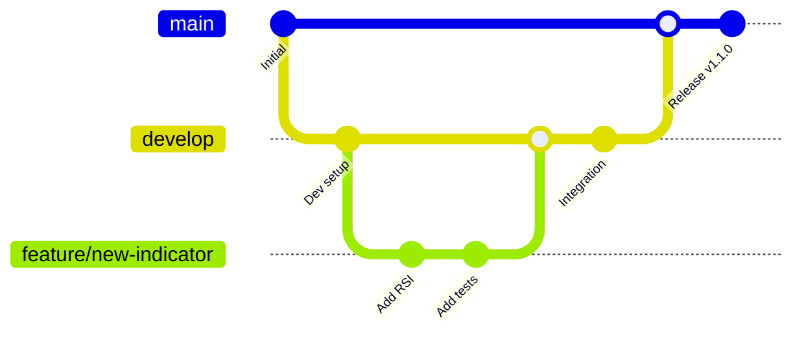
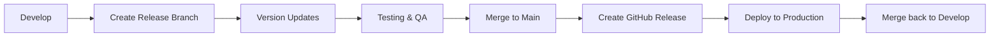

# Contributing to Roneira AI HIFI

<div align="center">


*We welcome contributions that improve correctness, performance, and developer experience.*

[**Quick Start**](#quick-start) • [**Development Setup**](#development-setup) • [**Code Style**](#code-style) • [**Testing**](#testing) • [**Pull Requests**](#pull-request-workflow)

</div>

## Table of Contents

<details>
<summary>Click to expand navigation</summary>

- [Quick Start](#quick-start)
- [Development Setup](#development-setup)
- [Branching Model](#branching-model)
- [Commit Guidelines](#commit-guidelines)
- [Code Style Guidelines](#code-style-guidelines)
- [Testing Requirements](#testing-requirements)
- [Pull Request Workflow](#pull-request-workflow)
- [Review Process](#review-process)
- [Release Process](#release-process)
- [Community Guidelines](#community-guidelines)
- [Getting Help](#getting-help)

</details>

## Quick Start

### First-Time Contributors

1. **Fork the repository** on GitHub
2. **Clone your fork** locally:
   ```bash
   git clone https://github.com/YOUR_USERNAME/Roneira-AI-HIFI.git
   cd Roneira-AI-HIFI
   ```
3. **Add upstream remote**:
   ```bash
   git remote add upstream https://github.com/aaron-seq/Roneira-AI-HIFI.git
   ```
4. **Set up development environment**:
   ```bash
   chmod +x scripts/setup.sh
   ./scripts/setup.sh
   ```
5. **Create a feature branch**:
   ```bash
   git checkout -b feature/your-feature-name
   ```
6. **Make your changes** and commit following our guidelines
7. **Push and create a Pull Request**

### Good First Issues

Look for issues labeled with:
- `good first issue` - Perfect for newcomers
- `help wanted` - Community contributions needed
- `documentation` - Improve docs and guides
- `bug` - Fix existing issues
- `enhancement` - Add new features

## Development Setup

### System Requirements

<table>
<tr>
<td width="50%">

**Required Software**
- Node.js >= 18.0.0
- Python >= 3.11
- Git >= 2.30
- Docker >= 20.10 (recommended)
- Docker Compose >= 2.0

</td>
<td width="50%">

**Recommended Tools**
- VS Code with extensions:
  - TypeScript and JavaScript Language Features
  - Python Extension Pack
  - Docker Extension
  - GitLens
  - Prettier - Code formatter

</td>
</tr>
</table>

### Environment Setup

<details>
<summary><strong>Automated Setup (Recommended)</strong></summary>

```bash
# Run the setup script
chmod +x scripts/setup.sh
./scripts/setup.sh

# This script will:
# 1. Install all dependencies
# 2. Set up environment files
# 3. Initialize the database
# 4. Run initial tests
# 5. Start development servers
```

</details>

<details>
<summary><strong>Manual Setup</strong></summary>

**1. Environment Configuration**
```bash
# Copy environment templates
cp .env.example .env
cp frontend/.env.example frontend/.env.local
cp backend/.env.example backend/.env
cp ml-service/.env.example ml-service/.env

# Edit each .env file with your configuration
```

**2. Install Dependencies**
```bash
# Frontend dependencies
cd frontend && npm ci && cd ..

# Backend dependencies
cd backend && npm ci && cd ..

# ML service dependencies
cd ml-service
python -m venv venv
source venv/bin/activate  # Windows: venv\Scripts\activate
pip install -r requirements.txt
pip install -r requirements-dev.txt
cd ..
```

**3. Database Setup**
```bash
# Start PostgreSQL and Redis (using Docker)
docker-compose up -d postgres redis

# Run database migrations
cd backend && npm run db:migrate && cd ..

# Seed development data
cd backend && npm run db:seed && cd ..
```

**4. Start Development Servers**
```bash
# Terminal 1: Frontend (http://localhost:3000)
cd frontend && npm run dev

# Terminal 2: Backend (http://localhost:3001)
cd backend && npm run dev

# Terminal 3: ML Service (http://localhost:5000)
cd ml-service && source venv/bin/activate && python app.py
```

</details>

### Docker Development

```bash
# Start all services with hot reloading
docker-compose -f docker-compose.yml -f docker-compose.dev.yml up

# Rebuild specific service
docker-compose build frontend

# View logs for specific service
docker-compose logs -f backend

# Run commands inside containers
docker-compose exec backend npm run test
docker-compose exec ml-service python -m pytest
```

## Branching Model

We follow a simplified Git Flow model with the following branch types:



### Branch Types

| Branch Type | Purpose | Naming Convention | Lifetime |
|-------------|---------|-------------------|----------|
| `main` | Production-ready code, protected | `main` | Permanent |
| `develop` | Integration branch for next release | `develop` | Permanent |
| `feature/` | New features and enhancements | `feature/issue-number-description` | Short-lived |
| `bugfix/` | Bug fixes for develop branch | `bugfix/issue-number-description` | Short-lived |
| `hotfix/` | Critical fixes for production | `hotfix/issue-number-description` | Short-lived |
| `release/` | Release preparation | `release/version-number` | Short-lived |

### Branch Naming Examples

```bash
# Good examples
feature/123-add-cryptocurrency-support
bugfix/456-fix-portfolio-calculation
hotfix/789-security-vulnerability-patch
release/2.1.0

# Bad examples
feature/crypto        # Too vague
my-new-feature       # No issue reference
FIX-BUG             # Wrong case, no description
```

## Commit Guidelines

### Conventional Commits

We follow the [Conventional Commits](https://www.conventionalcommits.org/) specification:

```
<type>[optional scope]: <description>

[optional body]

[optional footer(s)]
```

#### Commit Types

| Type | Description | Release Impact |
|------|-------------|----------------|
| `feat` | New feature | Minor version bump |
| `fix` | Bug fix | Patch version bump |
| `docs` | Documentation only | No version bump |
| `style` | Code style changes (formatting, etc.) | No version bump |
| `refactor` | Code refactoring | No version bump |
| `perf` | Performance improvements | Patch version bump |
| `test` | Adding or updating tests | No version bump |
| `build` | Build system or dependencies | No version bump |
| `ci` | CI/CD changes | No version bump |
| `chore` | Maintenance tasks | No version bump |
| `revert` | Reverting previous commit | Depends on reverted commit |

#### Scopes

Use these scopes to indicate which part of the codebase is affected:

- `frontend` - React/TypeScript frontend changes
- `backend` - Node.js/Express backend changes
- `ml` - Python ML service changes
- `api` - API-related changes
- `db` - Database schema or query changes
- `auth` - Authentication/authorization changes
- `ui` - UI component changes
- `docs` - Documentation changes
- `deps` - Dependency updates

#### Examples

```bash
# Good commit messages
feat(ml): add support for cryptocurrency price prediction
fix(api): resolve race condition in portfolio calculation
perf(db): optimize query performance for large datasets
docs(readme): update installation instructions for Windows
test(frontend): add unit tests for prediction components
refactor(backend): extract common validation logic

# Commit with body and footer
feat(auth): implement multi-factor authentication

Add TOTP-based 2FA using authenticator apps.
Includes QR code generation and backup codes.

Closes #123
Breaking-change: Auth API now requires 2FA for admin users
```

### Commit Message Rules

- **Use imperative mood** ("add" not "added" or "adds")
- **Capitalize first letter** of description
- **No period** at end of description
- **Limit description to 50 characters**
- **Wrap body at 72 characters**
- **Reference issues** using "Closes #123" or "Refs #456"
- **Indicate breaking changes** with "BREAKING CHANGE:" in footer

### Pre-commit Hooks

We use pre-commit hooks to ensure code quality:

```bash
# Install pre-commit hooks
npm run prepare

# Manually run pre-commit checks
npm run pre-commit

# Skip hooks for emergency commits (not recommended)
git commit --no-verify -m "emergency fix"
```

## Code Style Guidelines

### TypeScript (Frontend/Backend)

<details>
<summary><strong>General Principles</strong></summary>

- **Strict TypeScript**: Enable `strict` mode and use explicit types
- **Descriptive Naming**: Use domain-relevant variable names
- **Pure Functions**: Prefer pure functions, isolate side effects
- **Error Handling**: Return typed error objects with actionable context
- **Documentation**: Use JSDoc for complex functions and public APIs

</details>

<details>
<summary><strong>Naming Conventions</strong></summary>

```typescript
// Variables and functions: camelCase
const priceVelocity = calculatePriceVelocity(data);
const portfolioSnapshot = getPortfolioSnapshot();

// Classes: PascalCase
class TechnicalIndicator {
  calculateRSI(prices: number[]): number {
    // Implementation
  }
}

// Constants: SCREAMING_SNAKE_CASE
const MAX_PORTFOLIO_SIZE = 100;
const API_ENDPOINTS = {
  PREDICTIONS: '/api/v1/predictions',
  PORTFOLIO: '/api/v1/portfolio'
} as const;

// Interfaces and Types: PascalCase
interface PredictionRequest {
  ticker: string;
  days: number;
  includeConfidence: boolean;
}

type ModelType = 'randomforest' | 'xgboost' | 'lstm';
```

</details>

<details>
<summary><strong>File Structure</strong></summary>

```typescript
// File organization example
src/
├── components/          # React components
│   ├── ui/             # Reusable UI components
│   ├── prediction/     # Prediction-specific components
│   └── portfolio/      # Portfolio-specific components
├── hooks/              # Custom React hooks
├── services/           # API services and utilities
├── types/              # TypeScript type definitions
├── utils/              # Utility functions
└── constants/          # Application constants

// Import order
import React from 'react';                    // External libraries first
import { Button } from '@/components/ui';      // Internal imports with aliases
import { PredictionService } from '../services'; // Relative imports last
```

</details>

### Python (ML Service)

<details>
<summary><strong>Code Style</strong></summary>

- **PEP 8 Compliance**: Follow Python style guide strictly
- **Type Hints**: Use type hints for all function signatures
- **Docstrings**: Use Google-style docstrings
- **Error Handling**: Implement comprehensive error handling
- **Vectorization**: Optimize for NumPy/Pandas operations

</details>

<details>
<summary><strong>Example Code</strong></summary>

```python
from typing import List, Tuple, Optional
import numpy as np
import pandas as pd
from dataclasses import dataclass

@dataclass
class PredictionResult:
    """Container for ML prediction results.
    
    Attributes:
        price: Predicted price value
        confidence: Confidence interval (lower, upper)
        probability: Prediction probability score
        timestamp: Prediction timestamp
    """
    price: float
    confidence: Tuple[float, float]
    probability: float
    timestamp: pd.Timestamp

class TechnicalIndicators:
    """Technical analysis indicators calculator.
    
    This class provides vectorized implementations of common
    technical indicators used in financial analysis.
    """
    
    @staticmethod    
    def calculate_rsi(
        prices: pd.Series, 
        period: int = 14,
        *, 
        fill_na: bool = True
    ) -> pd.Series:
        """Calculate Relative Strength Index (RSI).
        
        Args:
            prices: Series of price values
            period: RSI calculation period (default: 14)
            fill_na: Whether to fill NaN values (default: True)
            
        Returns:
            Series containing RSI values (0-100)
            
        Raises:
            ValueError: If period is less than 1 or prices is empty
        """
        if period < 1:
            raise ValueError("Period must be greater than 0")
        
        if prices.empty:
            raise ValueError("Prices series cannot be empty")
            
        # Vectorized RSI calculation
        delta = prices.diff()
        gain = delta.where(delta > 0, 0)
        loss = -delta.where(delta < 0, 0)
        
        avg_gain = gain.rolling(window=period).mean()
        avg_loss = loss.rolling(window=period).mean()
        
        rs = avg_gain / avg_loss
        rsi = 100 - (100 / (1 + rs))
        
        if fill_na:
            rsi = rsi.fillna(50)  # Neutral RSI for initial values
            
        return rsi
```

</details>

### Configuration Files

<details>
<summary><strong>ESLint Configuration</strong></summary>

```json
{
  "extends": [
    "@typescript-eslint/recommended",
    "prettier"
  ],
  "rules": {
    "@typescript-eslint/no-unused-vars": "error",
    "@typescript-eslint/explicit-function-return-type": "warn",
    "prefer-const": "error",
    "no-var": "error"
  }
}
```

</details>

<details>
<summary><strong>Prettier Configuration</strong></summary>

```json
{
  "semi": true,
  "trailingComma": "es5",
  "singleQuote": true,
  "printWidth": 80,
  "tabWidth": 2,
  "useTabs": false
}
```

</details>

## Testing Requirements

### Test Coverage Goals

| Component | Unit Tests | Integration Tests | E2E Tests |
|-----------|------------|-------------------|----------|
| Frontend | >85% | >70% | Critical paths |
| Backend | >90% | >80% | API endpoints |
| ML Service | >85% | >75% | Model accuracy |

### Testing Commands

```bash
# Run all tests
npm run test

# Frontend tests
cd frontend
npm run test              # Unit tests with Vitest
npm run test:ui           # Interactive test runner
npm run test:coverage     # Coverage report
npm run test:e2e          # End-to-end tests with Playwright

# Backend tests
cd backend
npm run test              # Unit and integration tests
npm run test:watch        # Watch mode
npm run test:integration  # Integration tests only
npm run test:load         # Load testing

# ML Service tests
cd ml-service
source venv/bin/activate
pytest                    # All tests
pytest --cov=.           # With coverage
pytest --benchmark       # Performance benchmarks
pytest -k "test_rsi"     # Specific test pattern
```

### Test Structure

<details>
<summary><strong>Frontend Test Example (Vitest + React Testing Library)</strong></summary>

```typescript
import { render, screen, fireEvent, waitFor } from '@testing-library/react';
import { vi } from 'vitest';
import { PredictionPanel } from '../PredictionPanel';
import { QueryClient, QueryClientProvider } from '@tanstack/react-query';

// Mock API service
vi.mock('@/services/prediction', () => ({
  PredictionService: {
    predict: vi.fn()
  }
}));

const renderWithQueryClient = (component: React.ReactElement) => {
  const queryClient = new QueryClient({
    defaultOptions: { queries: { retry: false } }
  });
  
  return render(
    <QueryClientProvider client={queryClient}>
      {component}
    </QueryClientProvider>
  );
};

describe('PredictionPanel', () => {
  beforeEach(() => {
    vi.clearAllMocks();
  });
  
  it('should render prediction form', () => {
    renderWithQueryClient(<PredictionPanel />);
    
    expect(screen.getByLabelText(/ticker symbol/i)).toBeInTheDocument();
    expect(screen.getByLabelText(/prediction days/i)).toBeInTheDocument();
    expect(screen.getByRole('button', { name: /predict/i })).toBeInTheDocument();
  });
  
  it('should submit prediction request', async () => {
    const mockPredict = vi.mocked(PredictionService.predict);
    mockPredict.mockResolvedValue({
      ticker: 'AAPL',
      predictions: [{ date: '2024-01-15', price: 185.42 }]
    });
    
    renderWithQueryClient(<PredictionPanel />);
    
    fireEvent.change(screen.getByLabelText(/ticker symbol/i), {
      target: { value: 'AAPL' }
    });
    
    fireEvent.click(screen.getByRole('button', { name: /predict/i }));
    
    await waitFor(() => {
      expect(mockPredict).toHaveBeenCalledWith({
        ticker: 'AAPL',
        days: 1
      });
    });
  });
});
```

</details>

<details>
<summary><strong>Backend Test Example (Jest + Supertest)</strong></summary>

```typescript
import request from 'supertest';
import { app } from '../app';
import { db } from '../database';

describe('POST /api/v1/predictions', () => {
  beforeAll(async () => {
    await db.migrate.latest();
  });
  
  afterAll(async () => {
    await db.destroy();
  });
  
  beforeEach(async () => {
    await db.seed.run();
  });
  
  it('should return prediction for valid ticker', async () => {
    const response = await request(app)
      .post('/api/v1/predictions')
      .send({
        ticker: 'AAPL',
        days: 1
      })
      .expect(200);
    
    expect(response.body).toMatchObject({
      ticker: 'AAPL',
      predictions: expect.arrayContaining([
        expect.objectContaining({
          date: expect.any(String),
          price: expect.any(Number)
        })
      ])
    });
  });
  
  it('should validate request body', async () => {
    await request(app)
      .post('/api/v1/predictions')
      .send({
        ticker: '',  // Invalid empty ticker
        days: 0      // Invalid days
      })
      .expect(400);
  });
});
```

</details>

<details>
<summary><strong>ML Service Test Example (pytest)</strong></summary>

```python
import pytest
import pandas as pd
import numpy as np
from unittest.mock import Mock, patch

from src.indicators import TechnicalIndicators
from src.models import PredictionModel
from src.exceptions import ValidationError

class TestTechnicalIndicators:
    """Test suite for technical indicators."""
    
    def setup_method(self):
        """Set up test data before each test."""
        # Create sample price data
        dates = pd.date_range('2024-01-01', periods=50, freq='D')
        prices = 100 + np.cumsum(np.random.randn(50) * 0.02)  # Random walk
        self.price_series = pd.Series(prices, index=dates)
    
    def test_calculate_rsi_valid_input(self):
        """Test RSI calculation with valid input."""
        rsi = TechnicalIndicators.calculate_rsi(self.price_series, period=14)
        
        # Check output properties
        assert isinstance(rsi, pd.Series)
        assert len(rsi) == len(self.price_series)
        assert rsi.min() >= 0
        assert rsi.max() <= 100
        assert not rsi.isna().any()  # Should fill NaN values
    
    def test_calculate_rsi_invalid_period(self):
        """Test RSI calculation with invalid period."""
        with pytest.raises(ValueError, match="Period must be greater than 0"):
            TechnicalIndicators.calculate_rsi(self.price_series, period=0)
    
    def test_calculate_rsi_empty_series(self):
        """Test RSI calculation with empty price series."""
        empty_series = pd.Series([], dtype=float)
        
        with pytest.raises(ValueError, match="Prices series cannot be empty"):
            TechnicalIndicators.calculate_rsi(empty_series)
    
    @pytest.mark.benchmark
    def test_rsi_performance(self, benchmark):
        """Benchmark RSI calculation performance."""
        large_series = pd.Series(np.random.randn(10000))
        
        result = benchmark(TechnicalIndicators.calculate_rsi, large_series)
        
        # Performance assertions
        assert len(result) == 10000

class TestPredictionModel:
    """Test suite for ML prediction model."""
    
    @patch('src.models.yfinance.download')
    def test_predict_valid_ticker(self, mock_download):
        """Test prediction with valid ticker symbol."""
        # Mock market data
        mock_data = pd.DataFrame({
            'Open': [100, 101, 102],
            'High': [101, 102, 103],
            'Low': [99, 100, 101],
            'Close': [100.5, 101.5, 102.5],
            'Volume': [1000000, 1100000, 1200000]
        })
        mock_download.return_value = mock_data
        
        model = PredictionModel()
        result = model.predict('AAPL', days=1)
        
        assert result.ticker == 'AAPL'
        assert len(result.predictions) == 1
        assert isinstance(result.predictions[0].price, float)
        assert result.confidence > 0
    
    def test_predict_invalid_ticker(self):
        """Test prediction with invalid ticker symbol."""
        model = PredictionModel()
        
        with pytest.raises(ValidationError, match="Invalid ticker symbol"):
            model.predict('', days=1)
```

</details>

## Pull Request Workflow

### Before Creating a PR

**Pre-flight Checklist**
- [ ] Code follows style guidelines and passes linting
- [ ] All tests pass locally
- [ ] New code has appropriate test coverage
- [ ] Documentation updated (README, API docs, comments)
- [ ] Commit messages follow conventional commit format
- [ ] No merge conflicts with target branch
- [ ] Large changes are broken into smaller, focused PRs

### PR Creation

**PR Title Format**
```
<type>[scope]: <description>

# Examples:
feat(ml): add cryptocurrency price prediction support
fix(api): resolve race condition in portfolio calculations
docs(readme): update Docker setup instructions
```

**PR Description Template**
```markdown
## Summary
Brief description of what this PR does and why.

## Changes
- List of specific changes made
- Use bullet points for clarity
- Include any breaking changes

## Testing
- [ ] Unit tests added/updated
- [ ] Integration tests pass
- [ ] Manual testing completed
- [ ] Performance impact assessed

## Screenshots/Demo
(If applicable, include screenshots or demo links)

## Related Issues
Closes #123
Refs #456

## Deployment Notes
(Any special deployment considerations)

## Breaking Changes
(List any breaking changes and migration steps)
```

### PR Labels

| Label | Description |
|-------|-------------|
| `bug` | Bug fixes |
| `enhancement` | New features |
| `documentation` | Documentation updates |
| `dependencies` | Dependency updates |
| `breaking change` | Introduces breaking changes |
| `needs review` | Ready for review |
| `work in progress` | Not ready for review |
| `good first issue` | Good for new contributors |

## Review Process

### Code Review Guidelines

**For Reviewers**
- Focus on code correctness, security, and maintainability
- Provide constructive feedback with explanations
- Suggest improvements rather than just pointing out problems
- Approve PRs that meet standards, even if not perfect
- Use collaborative language ("we could" vs "you should")

**For Authors**
- Respond to all review comments
- Make requested changes promptly
- Ask questions if feedback is unclear
- Request re-review after making changes
- Be open to feedback and alternative approaches

### Review Requirements

| Change Type | Required Reviewers | Additional Requirements |
|-------------|-------------------|------------------------|
| Bug fixes | 1 maintainer | Tests must pass |
| New features | 2 maintainers | Design discussion |
| Breaking changes | All maintainers | Migration guide |
| Security fixes | Security team | Security review |
| Dependencies | 1 maintainer | Security scan |

### Automated Checks

All PRs must pass these automated checks:

```yaml
# GitHub Actions checks
✓ Lint (ESLint, Prettier, Black)
✓ Type Check (TypeScript, mypy)
✓ Unit Tests (>85% coverage)
✓ Integration Tests
✓ Security Scan (Snyk, CodeQL)
✓ Performance Tests
✓ Build Verification
```

## Release Process

### Semantic Versioning

We follow [Semantic Versioning 2.0.0](https://semver.org/):

- **MAJOR** (X.0.0): Breaking changes
- **MINOR** (1.X.0): New features, backward compatible
- **PATCH** (1.1.X): Bug fixes, backward compatible

### Release Workflow



**Release Steps**
1. Create release branch: `git checkout -b release/2.1.0`
2. Update version numbers in package.json files
3. Update CHANGELOG.md with release notes
4. Run full test suite and QA testing
5. Create PR to main branch
6. After merge, create GitHub release with tags
7. Deploy to production environments
8. Merge release branch back to develop

### Changelog Format

```markdown
# Changelog

## [2.1.0] - 2024-01-15

### Added
- Cryptocurrency price prediction support
- Real-time portfolio notifications
- Advanced technical analysis indicators

### Changed
- Improved ML model accuracy by 15%
- Updated UI design for better accessibility
- Enhanced API rate limiting

### Fixed
- Portfolio calculation race condition
- Memory leak in ML service
- Chart rendering on mobile devices

### Security
- Updated dependencies with security patches
- Enhanced input validation

### Breaking Changes
- API endpoint `/api/predictions` renamed to `/api/v1/predictions`
- Database schema changes require migration
```

## Community Guidelines

### Communication Channels

- **GitHub Issues**: Bug reports, feature requests
- **GitHub Discussions**: General questions, ideas, showcase
- **Pull Requests**: Code contributions and reviews
- **Email**: aaronsequeira12@gmail.com for private matters

### Recognition

We recognize contributions through:

- **Contributors List**: Maintained in README.md
- **Release Notes**: Contributors credited in each release
- **GitHub Stars**: Star contributors with significant contributions
- **Blog Posts**: Featuring community contributions

### Contribution Types

We value all types of contributions:

- **Code**: New features, bug fixes, performance improvements
- **Documentation**: Guides, API docs, examples, translations
- **Testing**: Writing tests, reporting bugs, testing releases
- **Design**: UI/UX improvements, accessibility enhancements
- **Community**: Helping others, mentoring, organizing events

## Getting Help

### Resources

- [**Project Documentation**](https://docs.roneira.com)
- [**API Reference**](https://api.roneira.com/docs)
- [**GitHub Discussions**](https://github.com/aaron-seq/Roneira-AI-HIFI/discussions)
- [**Issue Tracker**](https://github.com/aaron-seq/Roneira-AI-HIFI/issues)

### Support Channels

**For Technical Questions**
- GitHub Discussions (preferred)
- Stack Overflow with `roneira-ai` tag
- Project documentation and FAQ

**For Bug Reports**
- GitHub Issues with bug report template
- Include reproduction steps and environment details
- Search existing issues before creating new ones

**For Feature Requests**
- GitHub Discussions for initial discussion
- GitHub Issues for formal feature requests
- Include use cases and mockups if applicable

### Mentorship Program

New contributors can request mentorship:

1. Comment on a "good first issue" expressing interest
2. Tag a maintainer for guidance
3. Join our contributor onboarding program
4. Participate in regular office hours

---

<div align="center">

**Thank you for contributing to Roneira AI HIFI!**

Your contributions help make financial intelligence accessible to everyone.

[**Start Contributing**](https://github.com/aaron-seq/Roneira-AI-HIFI/issues?q=is%3Aissue+is%3Aopen+label%3A%22good+first+issue%22) • [**Join Discussions**](https://github.com/aaron-seq/Roneira-AI-HIFI/discussions) • [**View Roadmap**](https://github.com/aaron-seq/Roneira-AI-HIFI/projects)

</div>