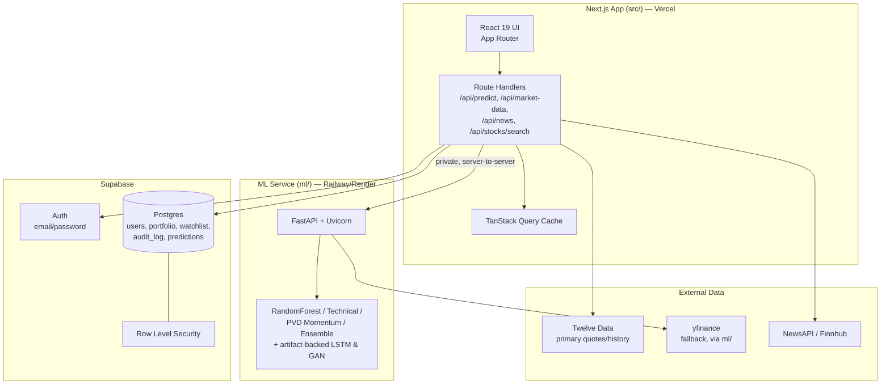
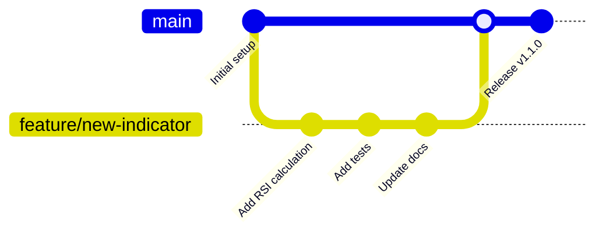

# Roneira AI HIFI High-Impact Finance Intelligence Platform

<div align="center">


[](https://opensource.org/licenses/MIT)
[](https://github.com/aaron-seq/Roneira-AI-HIFI/actions)

*A production-grade financial analytics framework engineered for robust machine learning forecasting, advanced price-volume momentum analytics, and comprehensive portfolio intelligence in institutional or retail trading environments.*

[**Live Demo**](https://roneira-ai-hifi.vercel.app) • [**Architecture**](ARCHITECTURE.md) • [**Deployment**](DEPLOYMENT.md) • [**Contributing**](CONTRIBUTING.md)

</div>

## Table of Contents

<details>
<summary>Click to expand navigation</summary>

- [Overview](#overview)
- [Key Features](#key-features)
- [Architecture & Technology Stack](#architecture--technology-stack)
- [UI Components & Features](#ui-components--features)
- [Getting Started](#getting-started)
- [Configuration](#configuration)
- [API Documentation](#api-documentation)
- [Performance & Optimizations](#performance--optimizations)
- [Security Implementation](#security-implementation)
- [Testing Strategy](#testing-strategy)
- [Deployment](#deployment)
- [Contributing](#contributing)
- [Monitoring & Observability](#monitoring--observability)
- [Roadmap](#roadmap)
- [Support & Community](#support--community)
- [License](#license)

</details>

## Overview

Roneira AI HIFI represents the convergence of advanced machine learning, real-time financial data processing, and institutional-grade analytics in a comprehensive financial intelligence platform. Built with modern microservices architecture, the platform delivers:

- **Precision ML Forecasting**: RandomForest-based regression models with engineered technical features
- **Real-time Analytics**: Live market data processing with sub-second latency
- **Portfolio Intelligence**: Advanced risk assessment and correlation analysis
- **Scalable Infrastructure**: Container-native architecture for seamless scaling

### Core Objectives

<table>
<tr>
<td>

**Reliability** 
- Reproducible ML predictions
- Deterministic model training
- Comprehensive error handling

</td>
<td>

**Scalability** 
- Microservices architecture
- Container orchestration
- Auto-scaling capabilities

</td>
<td>

**Performance**
- Sub-second API responses
- Optimized data pipelines
- Intelligent caching layers

</td>
</tr>
</table>

## Key Features

### Machine Learning & Analytics

The lists below describe what's actually implemented and verified working — not a
roadmap. See [IDEAS.md](./IDEAS.md) for near-term and speculative extensions
(backtesting, alerting, options-flow data, etc. are not built yet).

<details>
<summary><strong>Six-model ensemble, with disagreement surfaced, not hidden</strong></summary>

- **RandomForest** — refit per prediction request with `TimeSeriesSplit`, on engineered
  price/volume/volatility features (~2.6s per call, real, not cached).
- **Technical** and **PVD Momentum** — deterministic rule-based signal engines (see below).
- **LSTM and GAN slots** — gradient-boosted (`xgboost`), trained offline on 5 years of real
  market data (9 tickers, ~10,400 windows each), artifacts committed to the repo. TensorFlow
  is not a dependency; see [ARCHITECTURE.md](./ARCHITECTURE.md#ml-service-ml) for why and
  the measured skill of these two models (honestly: no edge over a naive "no change"
  baseline at a 30-day horizon — the confidence score reflects that).
- **Ensemble** — a weighted blend (0.35 / 0.25 / 0.25 / 0.15) that also returns each
  constituent model's own price target, confidence, and signal, plus an agreement score.
  The Predict page's model-spread view plots these against spot so you can see when models
  disagree instead of only the averaged number.

</details>

<details>
<summary><strong>PDM (price/volume/derivative) momentum engine</strong></summary>

`ml/app/models/pdm_momentum.py` — deterministic, no training step:

- Price momentum and volume-signal computation
- A derivative-style velocity signal over the price series
- Support/resistance levels from recent highs/lows
- Trend strength and momentum-divergence detection

</details>

<details>
<summary><strong>Technical analysis suite</strong></summary>

Six indicators, each with its own buy/sell/neutral signal:
RSI (14), MACD, Bollinger Bands, EMA 20/50, Stochastic RSI, ADX.

</details>

### Portfolio Management

<details>
<summary><strong>Holdings, P&amp;L, and audit trail</strong></summary>

- **Live valuation**: holdings priced against the same quote pipeline as Market Overview,
  with total value, invested capital, today's change, and per-holding P&L
- **Sector allocation** breakdown and a concentration-based risk score
- **Buy/sell as an atomic upsert**: `portfolio_holdings` has a unique `(user, ticker)`
  constraint, so a transaction can't race a read-then-write on the same position
- **Every change is audited**: DB triggers write `audit_log` rows for portfolio and
  watchlist changes, so the trail doesn't depend on the client remembering to log it —
  see the Audit Log page and [ARCHITECTURE.md](./ARCHITECTURE.md#auth)

VaR, correlation matrices, beta analysis, automated rebalancing, and tax-loss harvesting
are not implemented. If you need one of these, check [IDEAS.md](./IDEAS.md) — portfolio
risk allocation is scoped there as a mid-term item.

</details>

## Architecture & Technology Stack

> For the full C4-style component breakdown, data flow diagrams, and guardrails, see [ARCHITECTURE.md](./ARCHITECTURE.md). This section is a summary.


```mermaid
graph TB
    subgraph "Next.js App (src/) — Vercel"
        UI[React 19 UI<br/>App Router]
        API[Route Handlers<br/>/api/predict, /api/market-data,<br/>/api/news, /api/stocks/search]
        RQ[TanStack Query Cache]
    end

    subgraph "ML Service (ml/) — Railway/Render"
        MLAPI[FastAPI + Uvicorn]
        Models[RandomForest / Technical /<br/>PVD Momentum / Ensemble<br/>+ artifact-backed LSTM & GAN]
    end

    subgraph "Supabase"
        Auth[Auth<br/>email/password]
        Postgres[(Postgres<br/>users, portfolio, watchlist,<br/>audit_log, predictions)]
        RLS[Row Level Security]
    end

    subgraph "External Data"
        TwelveData[Twelve Data<br/>primary quotes/history]
        YFinance[yfinance<br/>fallback, via ml/]
        NewsAPI[NewsAPI / Finnhub]
    end

    UI --> API
    API --> RQ
    API -->|private, server-to-server| MLAPI
    MLAPI --> Models
    API --> Auth
    API --> Postgres
    Postgres --- RLS
    API --> TwelveData
    MLAPI --> YFinance
    API --> NewsAPI
```

### Core Services Matrix

| Service | Technology | Purpose | Deploys to |
|---------|------------|---------|-------------|
| **Web app** | Next.js 16 (App Router) + React 19 + TypeScript | UI, SSR/streaming, and API route handlers (BFF) | Vercel |
| **ML service** | Python + FastAPI + Uvicorn | Prediction inference (RandomForest, Technical, PVD Momentum, Ensemble, artifact-backed LSTM/GAN) | Railway / Render |
| **Auth & DB** | Supabase (Postgres + Auth + RLS) | Users, portfolio, watchlist, audit log, prediction history | Supabase-hosted |
| **State/cache (client)** | TanStack Query + Zustand | Client-side data fetching cache and UI state | Bundled with web app |
| **Rate limiting** | Upstash Redis (configured dependency) | API route abuse prevention | Upstash-hosted |

`frontend/`, `backend/`, and `ml-service/` are earlier implementations (Vite/React, Express, Flask) kept only as reference material — they are not built, tested, or deployed. See [Repository Layout](#repository-layout) below.

## UI Components & Features

### Dynamic Interface Components

<table>
<tr>
<td width="50%">

#### Core UI Components

**Navigation System**
- Responsive sidebar with collapsible menu
- Breadcrumb navigation with dynamic routing
- Global search with autocomplete
- User profile dropdown with settings

**Dashboard Components**
- Real-time metric cards with animations
- Interactive charts with zooming/panning
- Customizable widget layouts
- Dark/light theme toggle

**Data Visualization**
- Candlestick charts with volume overlays
- Technical indicator overlays
- Portfolio allocation pie charts
- Performance comparison line charts

</td>
<td width="50%">

#### Interactive Features

**Prediction Interface**
- Multi-ticker symbol search with fuzzy matching
- Prediction horizon slider (1-30 days)
- Confidence interval visualization
- Historical accuracy metrics

**Portfolio Management**
- Drag-and-drop position management
- Real-time P&L calculations
- Risk metrics dashboard
- Alert configuration panels

**Analysis Tools**
- Interactive backtesting interface
- Strategy parameter optimization
- Performance attribution breakdowns
- Correlation heatmaps

</td>
</tr>
</table>

### Component Architecture

```
src/components/
├── ui/            # Reusable primitives (buttons, inputs, skeletons, command palette)
├── auth/           # Login/signup forms
├── charts/          # lightweight-charts / recharts wrappers (PredictionChart, etc.)
├── prediction/       # ML prediction surface (SignalMeter, ConfidenceRing, ...)
└── shared/          # Cross-page layout and shared widgets
```

### Advanced UI Features

**Progressive Web App (PWA)**
- Offline functionality with service workers
- Push notifications for alerts
- App-like experience on mobile devices
- Background sync for data updates

**Real-time Updates**
- WebSocket connections for live data
- Optimistic UI updates
- Conflict resolution for concurrent edits
- Automatic reconnection handling

**Accessibility & Performance**
- WCAG 2.1 AA compliance
- Keyboard navigation support
- Screen reader compatibility
- Lazy loading with intersection observers
- Code splitting for optimal bundle sizes

## Repository Layout

This repository contains both the **active product** and older implementations
kept for reference. Contribute to the canonical paths only.

| Path | Status | What it is |
|------|--------|-----------|
| `src/` | **Canonical** | The Next.js application (UI + API route handlers). This is what deploys to Vercel — see `vercel.json`. |
| `ml/` | **Canonical** | The FastAPI ML service (LSTM, GAN, Random Forest, PDM momentum, ensemble). |
| `supabase/` | **Canonical** | Database schema and migrations. |
| `frontend/` | Legacy | Earlier Vite/React client. Not built, tested, or deployed. |
| `backend/` | Legacy | Earlier Express API gateway. Not built, tested, or deployed. |
| `ml-service/` | Legacy | Earlier Flask/FastAPI ML service. Not built, tested, or deployed. |
| `realtime/` | Legacy | Socket.IO tick service built against the legacy Vite frontend (CORS defaults to `localhost:5173`). Nothing in `src/` calls it and it isn't wired into CI. |

CI (`.github/workflows/ci.yml`) validates the canonical surfaces only. The
legacy trees are retained as reference material and intentionally do not gate
merges. See `task.md` for the authoritative statement of canonical paths.

> **Working on a fix?** If an issue names a file under `frontend/`, `backend/`,
> or `ml-service/`, check whether the behaviour still exists under `src/` or
> `ml/` — that is where the change usually belongs.

## Getting Started

### Prerequisites Checklist

- [ ] **Node.js** >= 18.0.0 ([Download](https://nodejs.org/))
- [ ] **Python** >= 3.11 ([Download](https://python.org/))
- [ ] **Docker** & Docker Compose ([Download](https://docker.com/))
- [ ] **Git** for version control
- [ ] **PostgreSQL** 15+ (optional for local development)
- [ ] **Redis** 7+ (optional for local development)

### Quick Start (5 minutes)

<details>
<summary><strong>1. Clone and Setup</strong></summary>

```bash
# Clone the repository
git clone https://github.com/aaron-seq/Roneira-AI-HIFI.git
cd Roneira-AI-HIFI

# Copy the environment template and fill in your values
cp .env.example .env.local

# Install web dependencies
npm ci
```

At minimum you need the Supabase variables in `.env.local` for auth and
persistence; market-data API keys are optional and the app degrades gracefully
without them. See [Configuration](#configuration) for the full list.

</details>

<details>
<summary><strong>2. Run the web app</strong></summary>

```bash
npm run dev        # http://localhost:3000
```

The Next.js app serves both the UI and its API route handlers
(`/api/predict`, `/api/market-data`, `/api/news`, `/api/stocks/search`, ...).
It is fully usable on its own — the ML service is only required for live
model-backed predictions.

</details>

<details>
<summary><strong>3. Run the ML service (optional)</strong></summary>

```bash
cd ml
python -m venv venv
source venv/bin/activate  # On Windows: venv\Scripts\activate
pip install -r requirements.txt

uvicorn app.main:app --reload --port 8000   # or: npm run ml:dev
```

Point the web app at it with `ML_BACKEND_URL=http://localhost:8000`.

The FastAPI service stays private behind the Next.js API routes. Its data
endpoints (`/predict`, `/market-data`, `/stock/{ticker}`, `/history`,
`/screener`) require a shared secret: set the **same** `ML_SERVICE_TOKEN` in
both `.env.local` and `ml/.env`, and the Next.js routes will send it as the
`X-ML-Service-Token` header. Generate one with `openssl rand -hex 32`.

If `ML_SERVICE_TOKEN` is unset on the ML side, those endpoints return 503 —
they fail closed rather than running unauthenticated. `/` and `/health` stay
open so platform health checks keep working.

**Model artifacts:** LSTM and GAN load bundled artifacts from
`ml/artifacts/generated` at startup and degrade gracefully when the artifacts
(or TensorFlow) are unavailable. Generate them with `npm run train:ml`.

</details>

<details>
<summary><strong>4. Verify your setup</strong></summary>

```bash
npm run lint
npm run type-check
npm run test:web
npm run build

cd ml && python -m pytest tests -q
```

These are exactly the checks CI runs.

</details>

### Development Workflow


```mermaid
gitGraph
    commit id: "Initial setup"
    branch feature/new-indicator
    checkout feature/new-indicator
    commit id: "Add RSI calculation"
    commit id: "Add tests"
    commit id: "Update docs"
    checkout main
    merge feature/new-indicator
    commit id: "Release v1.1.0"
```

## Configuration

### Environment Variables Reference

<details open>
<summary><strong>Frontend Configuration</strong></summary>

| Variable | Default | Description |
|----------|---------|-------------|
| `VITE_API_BASE_URL` | `http://localhost:3001` | Backend API endpoint |
| `VITE_WS_URL` | `ws://localhost:3001` | WebSocket server URL |
| `VITE_APP_NAME` | `Roneira AI HIFI` | Application display name |
| `VITE_APP_VERSION` | `3.0.0` | Version identifier |
| `VITE_SENTRY_DSN` | - | Error tracking DSN |
| `VITE_ANALYTICS_ID` | - | Google Analytics ID |

</details>

<details>
<summary><strong>Backend Configuration</strong></summary>

| Variable | Default | Description |
|----------|---------|-------------|
| `PORT` | `3001` | Server listening port |
| `NODE_ENV` | `development` | Runtime environment |
| `DATABASE_URL` | - | PostgreSQL connection string |
| `REDIS_URL` | - | Redis connection string |
| `JWT_SECRET` | - | JWT signing secret |
| `ML_SERVICE_URL` | `http://localhost:5000` | ML service endpoint |
| `RATE_LIMIT_WINDOW` | `900000` | Rate limit window (15min) |
| `RATE_LIMIT_MAX` | `100` | Max requests per window |

</details>

<details>
<summary><strong>ML Service Configuration</strong></summary>

| Variable | Default | Description |
|----------|---------|-------------|
| `FLASK_ENV` | `development` | Flask environment |
| `MODEL_CACHE_TTL` | `3600` | Model cache TTL (seconds) |
| `FEATURE_CACHE_SIZE` | `1000` | Feature cache size |
| `HUGGING_FACE_API_KEY` | - | HF API key for sentiment |
| `ALPHA_VANTAGE_API_KEY` | - | Market data API key |
| `GUNICORN_WORKERS` | `4` | Production worker count |

</details>

## API Documentation

These are the actual Next.js route handlers under `src/app/api/` — there is
no `/api/v1/*` prefix and no GraphQL API; portfolio and watchlist reads/writes
go directly through the Supabase client (RLS-scoped to the signed-in user)
rather than a dedicated REST endpoint.

| Route | Method | Purpose | Auth | Rate limit |
|---|---|---|---|---|
| `/api/predict` | POST | Forward to the `ml/` service, persist result to `predictions_cache`/`prediction_history`/`audit_log` | optional | 20/min |
| `/api/market-data` | GET | Quotes by `group` (`market-overview`\|`commodities-forex`\|`peer-comparison`) or `symbols` | none | 60/min |
| `/api/market-data/history` | GET | OHLCV candles for a symbol | none | 60/min |
| `/api/stocks/search` | GET | Symbol search (Finnhub, falls back to Alpha Vantage) | none | 30/min |
| `/api/news` | GET | Headlines + sentiment classification | none | 30/min |
| `/api/auth/username` | GET | Username availability check | none | 20/min |
| `/api/auth/username` | POST | Username + password login | none | 10/min |
| `/api/audit-log` | POST | Write an audit row | required | — |
| `/api/admin/overview` | GET | Admin dashboard summary (users, audit log, ML health) | admin role | — |

The `ml/` service's own auto-generated docs (`GET /docs` on the FastAPI app,
e.g. `http://localhost:8000/docs` locally) cover its `/predict`,
`/market-data`, `/stock/{ticker}`, and `/history` endpoints in detail — it's
never called directly from the browser, only server-to-server from the
routes above.

## Performance & Optimizations

- **TanStack Query** owns client-side caching, retries, and refetch for every data hook in `src/lib/hooks/*` (stale-while-revalidate).
- **Server-side response caching**: quotes/search/history/news responses are cached for tens of seconds to minutes (`src/lib/server/cache.ts`) so repeat requests don't re-hit tightly-quota'd providers (Alpha Vantage: 25/day free tier).
- **Outbound fetch timeouts**: every server-side `fetch` to a provider or the ML service carries an `AbortSignal.timeout`, so a wedged upstream can't hang a route indefinitely.
- **ML service concurrency**: FastAPI route handlers are plain `def` (not `async def`) because they do blocking CPU/network work; FastAPI runs them in a threadpool. `/market-data` additionally fans out across symbols with a `ThreadPoolExecutor`.
- **Next.js code splitting**: the App Router code-splits per route by default; chart libraries (`lightweight-charts`, `recharts`) are only loaded on the pages that render them.

See [ARCHITECTURE.md](./ARCHITECTURE.md) for the full data-provider fallback chain and caching details.

## Security Implementation

- **Auth**: Supabase Auth (email/password), cookie-based sessions via `@supabase/ssr`, refreshed in `src/middleware.ts`.
- **Row Level Security**: enabled on every `public` table; admin-only reads route through a `SECURITY DEFINER` `is_admin()` function rather than querying `users` from within a policy on `users` (which previously caused infinite recursion — see `supabase/migrations/007_fix_admin_policy_recursion.sql`).
- **Input validation**: zod schemas for `/api/predict` and `/api/audit-log`; their enums intentionally mirror the Postgres `CHECK` constraints so invalid input fails as a 400 at the edge instead of a 500 from the database.
- **Rate limiting**: `src/lib/server/rate-limit.ts` — a fixed window over the Upstash Redis REST API (falls back to an in-process window without Upstash credentials) — applied to `/api/predict`, `/api/market-data`, `/api/market-data/history`, `/api/stocks/search`, `/api/news`, and `/api/auth/username`.
- **Audit logging**: `audit_log` has no `DELETE` policy for `anon`/`authenticated`, making it append-only through the normal client path (note: the `service_role` connection bypasses RLS entirely, as it does in any Postgres/Supabase project).
- **Security scanning**: `.github/workflows/ci.yml` runs a Trivy filesystem scan on every push/PR.

This section intentionally doesn't claim infrastructure this project doesn't have (no Vault, no WAF, no MFA at launch) — see [ARCHITECTURE.md § Guardrails](./ARCHITECTURE.md#guardrails) for what's actually enforced today and what's app-layer-only.

## Testing Strategy

What's actually configured, no coverage-percentage targets asserted since no coverage
tool is wired up to check them:

| Layer | Tool | What's covered |
|---|---|---|
| `src/` unit tests | Vitest | Pure logic: market data normalization, provider dedup, timeframe math, rate limiting, zod validation, news sentiment classification, cache. No `@testing-library/react` — no component-render tests currently. |
| `ml/` tests | pytest | Each of the 6 models (`test_models.py`) plus a real-FastAPI-entrypoint smoke test (`test_app_entrypoint.py`) that imports `app.main:app` and hits `/`, `/health` — this exists specifically because model-only tests don't catch a broken app import (e.g. a `requirements.txt` dependency that's missing at runtime). |
| Static analysis | ESLint, `tsc --noEmit` | Runs in CI and the pre-commit hook. |
| Security scan | Trivy (GitHub Action) | Filesystem vulnerability scan on every push/PR. |

No Jest/Supertest, no WebSocket tests (nothing in `src/` calls the orphaned `realtime/`
service — see `task.md`), no checked-in Playwright E2E suite, no visual-regression tooling.
If you want any of these, they'd be new work, not an existing-but-undocumented feature.

### Test Execution

```bash
# Web (Next.js) — unit tests
npm run test:web

# Web — watch mode while developing
npm run test:watch

# Static analysis
npm run lint
npm run type-check

# Production build (catches build-time-only errors)
npm run build

# ML service tests
cd ml && python -m pytest tests -q
# or, from the repo root:
npm run test:ml
```

Together these are the launch verification suite defined in `task.md`, and they
are precisely what the `Web CI` and `ML CI` jobs run on every pull request.

### CI/CD Pipeline

`.github/workflows/ci.yml` is the only workflow. It runs four jobs:

| Job | Steps |
|---|---|
| **Web CI** | `npm ci` → `npm run lint` → `npm run type-check` → `npm run test:web` → `npm run build` |
| **ML CI** | install `ml/requirements.txt` → `python -m pytest tests -q` (working dir `ml/`) |
| **Security Scan** | Trivy vulnerability scan → upload SARIF to the GitHub Security tab |
| **Deployment Readiness** | verify deployment files and that `.env.example` exists |

There is no coverage upload and no E2E job; don't infer either from this README.
`npm run test:coverage` and `npm run test:e2e` do not exist as scripts.

## Deployment

Three targets, matching [ARCHITECTURE.md](./ARCHITECTURE.md):

| Surface | Platform | Notes |
|---|---|---|
| `src/` (Next.js app) | Vercel | `vercel.json` describes this deployment. Set the Supabase and provider-key env vars from `.env.example` in the Vercel project settings. |
| `ml/` (FastAPI service) | Railway or Render | Boots `uvicorn app.main:app`. Only the Next.js server (not the browser) reaches it, via `ML_BACKEND_URL`. The service is publicly routable, so its data endpoints are guarded by `ML_SERVICE_TOKEN` — CORS alone does not restrict non-browser clients. |
| Auth + database | Supabase (hosted) | Apply `supabase/migrations/*.sql` in filename order (there is no `004`). |

**On free-tier hosting for `ml/`, verified rather than assumed:** Railway has no ongoing
free tier as of this writing — a one-time $5 trial credit, then usage-based billing.
Render's free web-service tier gives 750 instance-hours/month, has **no persistent disk**,
and spins down after 15 minutes idle. That matters here specifically because
`ml/artifacts/generated/{lstm,gan}_gbm.joblib` (the trained model files) are **committed to
the repo** rather than produced at deploy time — training against a live yfinance
connection on every cold start would be slow and would repeatedly hit the Yahoo
bot-detection rate limit documented in [ARCHITECTURE.md](./ARCHITECTURE.md#data-providers-and-fallback-chain).
Because the artifacts ship with the code, Render's free tier is enough: the service boots
with real trained models and makes zero live network calls to produce them.

Optional: Upstash Redis for shared rate limiting across serverless instances
(`UPSTASH_REDIS_URL`/`UPSTASH_REDIS_TOKEN`) — without it, rate limiting still
works but is per-instance rather than global.

`DEPLOYMENT.md` in this repo predates the canonical `src/`/`ml/` split and
describes the legacy Docker Compose / Railway-multi-service setup; treat it as
historical until it's rewritten, and use the table above instead.

### Pre-deploy checklist

- [ ] Supabase migrations applied **009 through the latest**, in filename order (there is no
      `004`). Migrations 007–009 specifically fix bugs found by hand after `001` was
      already live: 007 fixes RLS admin-policy recursion, 008 restores anon username
      lookup (needed for login), 009 makes `audit_log` append-only against a
      `service_role`/superuser connection too, not just the roles RLS restricts.
- [ ] Vercel env vars set: `NEXT_PUBLIC_SUPABASE_URL`, `NEXT_PUBLIC_SUPABASE_ANON_KEY`,
      `SUPABASE_SERVICE_ROLE_KEY`, `ML_BACKEND_URL`, `ML_SERVICE_TOKEN`
- [ ] `ML_SERVICE_TOKEN` set to the **same** value in the Railway/Render env for `ml/`.
      Without it the ML data endpoints return 503; mismatched, they return 401
- [ ] `ml/` deployed and reachable from Vercel at the URL above — no training step needed at
      deploy, the trained artifacts are committed (see the free-tier note above)
- [ ] `npm run build` and `python -m pytest ml/tests -q` both pass locally (same checks CI
      runs)

## Contributing

We welcome contributions from the community! Please see our [Contributing Guide](CONTRIBUTING.md) for detailed information on:

- Development workflow and branching strategy
- Code style guidelines and linting rules
- Testing requirements and coverage goals
- Pull request process and review guidelines
- Commit message conventions

### Quick Contribution Steps

1. **Fork** the repository
2. **Create** a feature branch: `git checkout -b feature/amazing-feature`
3. **Commit** your changes: `git commit -m 'feat: add amazing feature'`
4. **Push** to the branch: `git push origin feature/amazing-feature`
5. **Open** a Pull Request

### Development Tools

These are the actual scripts in `package.json` — see [Quick Start](#quick-start-5-minutes)
above for the full setup sequence:

```bash
npm run lint          # eslint
npm run type-check    # tsc --noEmit
npm run test:web      # vitest

npm run seed:admin    # scripts/seed-admin.mjs
```

There is no `lint:fix`, `format`, `dev:setup`, `pre-commit`, or `docs:generate` script.
The pre-commit hook itself lives at `.husky/pre-commit` and runs automatically on `git
commit` once `npm install` has run the `prepare` script (`git config core.hooksPath
.husky`) — there's no separate command to invoke it by hand.

## Monitoring & Observability

There is no metrics/tracing stack wired up today (no Prometheus, Grafana,
Sentry, etc.) — don't infer one from this README. What exists:

- **CI**: `.github/workflows/ci.yml` (lint, type-check, tests, build, Trivy scan) on every push/PR.
- **ML health check**: `GET /health` on the `ml/` service reports which models are loaded (`RandomForest`, `LSTM`, `GAN`, `Technical`, `PVD Momentum`, `Ensemble`) — surfaced in the admin dashboard (`/api/admin/overview`).
- **Audit trail**: `audit_log` records logins, signups, and portfolio/watchlist/prediction actions — see `src/app/dashboard/audit-log`.

If you add real monitoring, update this section to describe what's actually running rather than a wishlist.

## Roadmap

See [IDEAS.md](./IDEAS.md) for the full, triaged backlog of proposed
enhancements (PDM strategy improvements, technical-analysis additions,
alternative data, backtesting, portfolio optimization). This README doesn't
duplicate a roadmap here to avoid the two drifting out of sync.

## Support & Community

### Getting Help

<table>
<tr>
<td width="50%">

**Documentation & Resources**
- [📚 Architecture](ARCHITECTURE.md)
- [🚀 Deployment](DEPLOYMENT.md)
- [🤝 Contributing](CONTRIBUTING.md)
- [🔗 ML API reference](http://localhost:8000/docs) — FastAPI auto-docs, served by the running `ml/` service

</td>
<td width="50%">

**Community & Support**
- [💬 Discord Community](https://discord.gg/roneira)
- [🐛 Issue Tracker](https://github.com/aaron-seq/Roneira-AI-HIFI/issues)
- [💡 Feature Requests](https://github.com/aaron-seq/Roneira-AI-HIFI/discussions)
- [📧 Enterprise Support](mailto:enterprise@roneira.com)

</td>
</tr>
</table>

### FAQ

<details>
<summary><strong>How accurate are the ML predictions?</strong></summary>

See `ml/artifacts/generated/lstm_metadata.json` (regenerated by `npm run
train:ml`) for measured validation error against a naive "no change"
baseline, rather than a fixed number here — accuracy depends on the model,
timeframe, and current market regime, and this README won't assert a
directional-accuracy percentage it can't back with a live number.

</details>

<details>
<summary><strong>What data sources are used?</strong></summary>

Twelve Data (primary quotes/history), yfinance (fallback, via `ml/`), Finnhub
and Alpha Vantage (symbol search / secondary quotes), and NewsAPI (headlines).
See [ARCHITECTURE.md § Data providers](./ARCHITECTURE.md) for the fallback
order.

</details>

<details>
<summary><strong>Is the platform suitable for institutional use?</strong></summary>

Not at this stage — it's a personal/portfolio project with launch-scope auth
(Supabase email/password only) and no compliance certifications. Treat any
claim to the contrary in older docs as aspirational, not current.

</details>

## License

This project is licensed under the MIT License - see the [LICENSE](LICENSE) file for details.

---

<div align="center">

**Built with precision engineering for institutional-grade financial intelligence**

[🚀 **Get Started**](#quick-start) • [🌟 **Star on GitHub**](https://github.com/aaron-seq/Roneira-AI-HIFI)

*© 2026 Roneira Enterprises AI. All rights reserved.*

</div>
